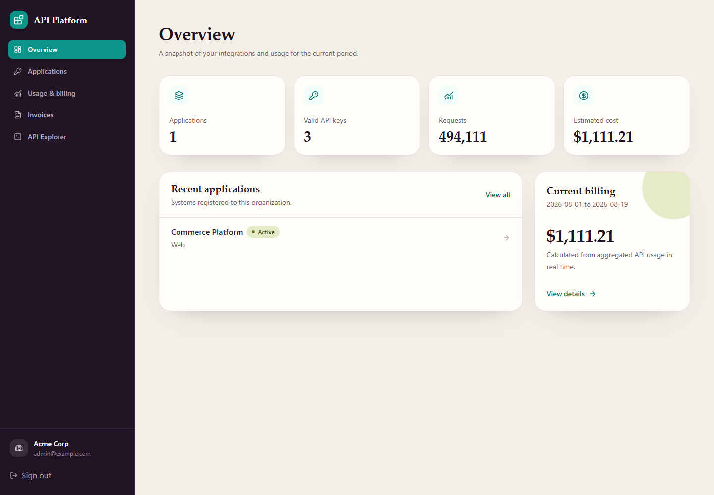
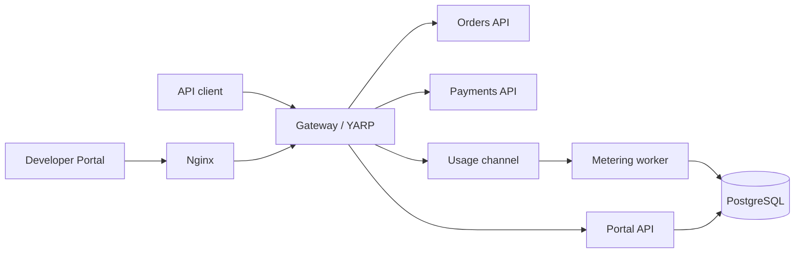
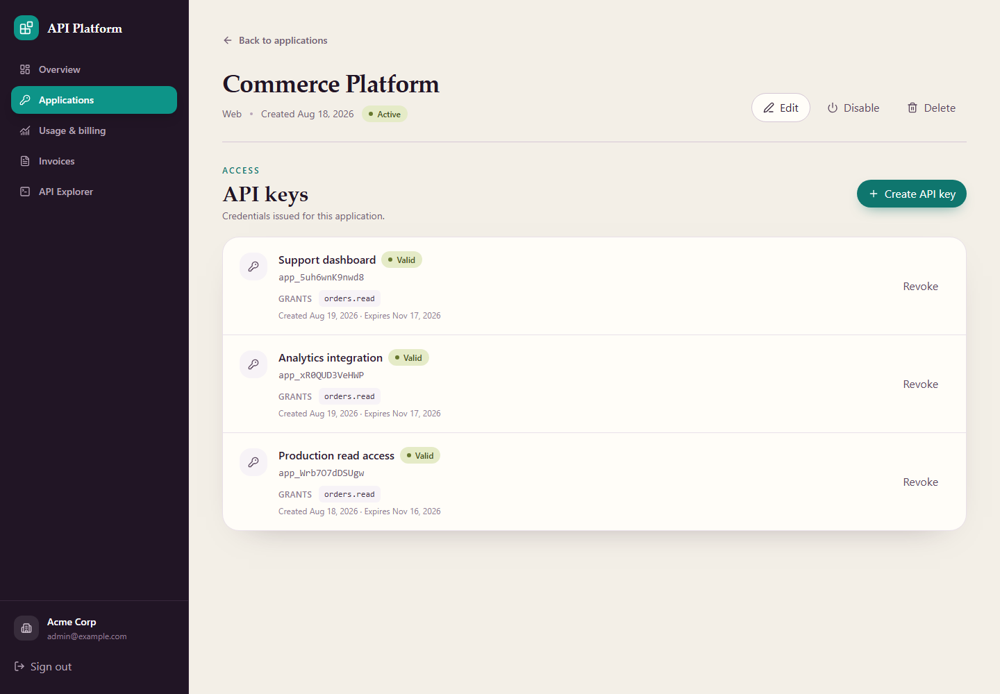
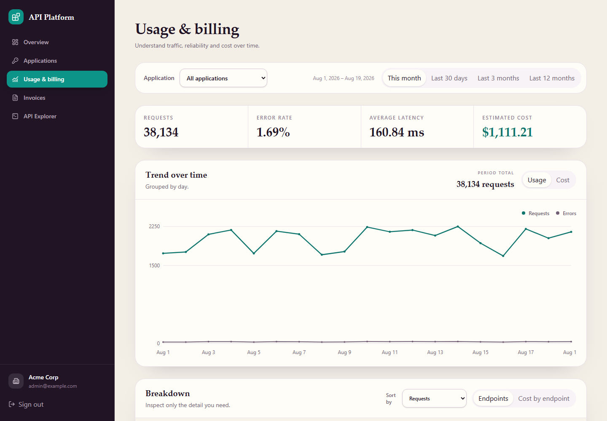
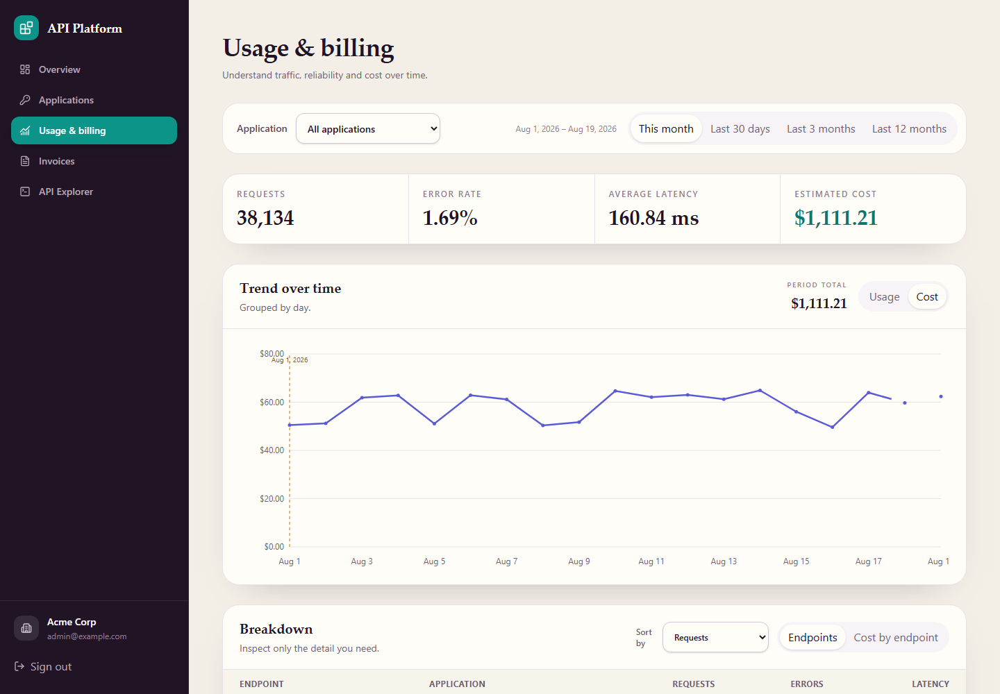
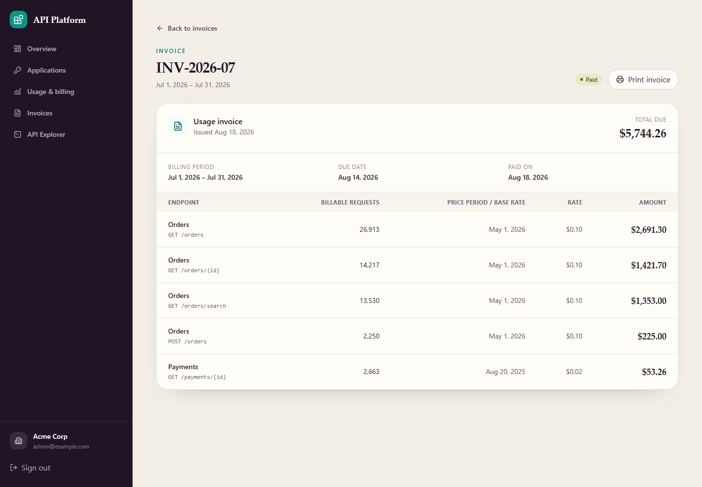
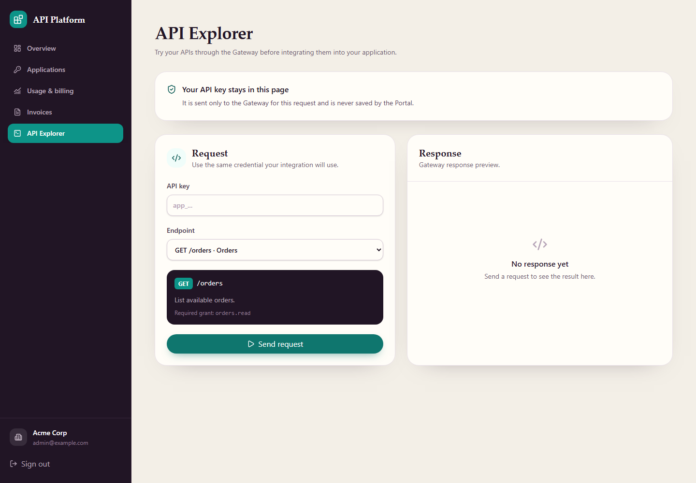

<div align="center">

# API Platform

A developer portal and secure gateway for companies that provide APIs to customers.


</div>

## What is this?

Imagine that a company offers **Orders** and **Payments** APIs to other companies. Each customer needs a secure way to access those APIs, permission to use only the allowed endpoints, usage limits, traffic reports and a monthly bill.

Building all of that separately inside every API would create duplicated logic. API Platform puts those responsibilities in one place.

A customer signs in to the Developer Portal, registers the system that will consume the APIs, generates an API key and chooses its permissions. That system sends requests through the Gateway. The Gateway validates the key, checks the permissions, forwards the request to the correct API and records the usage. The customer can then see traffic, errors, costs and invoices in the Portal.

It is a simplified combination of a **Stripe-like developer dashboard** and an **API management gateway** such as Kong or Azure API Management.



## Main concepts

| Term | Meaning in this project |
|---|---|
| Organization | A company that consumes the APIs. It is also the tenant boundary. |
| Application | A customer system, such as an ERP, website or background job. |
| API key | The credential used by an Application to identify itself. |
| Scope | A permission such as `orders.read` or `payments.write`. |
| Gateway | The single entry point that protects and routes the business APIs. |
| Metering | Counting requests, errors and latency for reports and billing. |

## From API key to invoice

```text
Create Application
  -> generate an API key with permissions
  -> call an API through the Gateway
  -> record usage without delaying the response
  -> calculate cost using the price valid on that date
  -> generate the monthly invoice
```

The platform covers that complete flow without requiring an external identity provider, telemetry service or payment processor.

## Architecture



The Gateway is the public backend entry point. Orders, Payments and the Portal API remain inside the Docker network.

For business routes, the Gateway validates the API key, checks scopes, applies rate limiting, records usage and removes `X-Api-Key` before proxying the request. Portal routes pass through the same Gateway as a transparent proxy and use a separate human login session.

## Application credentials

Each API key belongs to an Application and receives only the scopes selected at creation. The full key is displayed once; only its public client ID and a PBKDF2 hash of the secret are stored.

Multiple keys per Application allow credential rotation and selective revocation. Disabling an Application works as a reversible kill switch for all of its keys.



## Usage and cost

The Gateway publishes usage events to a bounded in-memory channel. A background worker aggregates and persists them, keeping PostgreSQL writes out of the request path.

The Portal exposes request volume, errors, latency and cost over time. Pricing uses effective dates, so rate changes do not rewrite historical usage.

| Traffic and reliability | Cost and pricing history |
|---|---|
| [](./.github/assets/usage.png) | [](./.github/assets/usage-cost.png) |

## Monthly invoices

A background service creates an invoice for each completed month. Lines are grouped by endpoint and pricing period, which keeps an issued invoice stable even when rates change later.

Payment is simulated locally by marking an open invoice as paid.



## API Explorer

Orders and Payments can be tested from the Portal without opening another client. Requests still go through the Gateway and use the same API key and scope validation as an external integration.



## Stack

| Area | Technology |
|---|---|
| Frontend | React 19, TypeScript, Vite, TanStack Query, Recharts, Tailwind CSS |
| Backend | .NET 10, ASP.NET Core, Entity Framework Core |
| Gateway | YARP Reverse Proxy |
| Database | PostgreSQL |
| Infrastructure | Docker Compose, Nginx |
| Tests | xUnit, Vitest, Testing Library |

## Run locally

Docker Desktop is the only requirement.

```bash
docker compose up --build -d
```

| Service | URL |
|---|---|
| Developer Portal | http://localhost:3000 |
| API Gateway | http://localhost:5290 |
| Portal API through the Gateway | http://localhost:3000/api |
| PostgreSQL | localhost:5432 |

Local login:

```text
Email: developer@acme.test
Password: DemoAccess123!
```

Migrations and the development seed are applied automatically by the Portal API.

```bash
docker compose ps
docker compose logs -f
docker compose down
```

`docker compose down` preserves the database volume. Use `docker compose down -v` to recreate the local database from scratch.

## Call an API

Business APIs are accessed through the Gateway:

```bash
curl http://localhost:5290/orders \
  -H "X-Api-Key: app_<client-id>.sk_<secret>"
```

## Repository layout

```text
backend/
  src/
    ApiPlatform.Gateway/
    ApiPlatform.PortalApi/
    ApiPlatform.OrdersApi/
    ApiPlatform.PaymentsApi/
  tests/
frontend/
  src/features/
database/
docs/
```

The Portal API and frontend are organized by feature. Gateway code is divided by responsibility: authentication, authorization, rate limiting, metering and proxy configuration.

## Technical documentation

- [Overview](./docs/00-overview.md)
- [Architecture](./docs/01-architecture.md)
- [Domain model](./docs/02-domain-model.md)
- [Authentication](./docs/03-auth.md)
- [Metering and billing](./docs/04-telemetry.md)
- [Architecture decisions](./docs/05-decisions.md)
