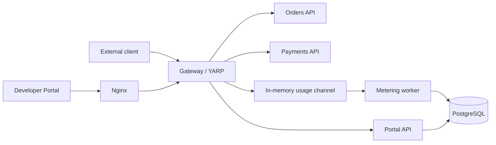

# Architecture

## Services



The Gateway and frontend are exposed by Docker Compose. Portal API, Orders and Payments remain inside the Compose network.

Nginx serves the frontend and proxies browser requests to the Gateway under the same origin. The Portal API is still reached through the Gateway, but its routes use transparent proxying and do not receive business API policies.

## Business API request

```text
Request
  → API key authentication
  → scope authorization
  → rate limiting by Application
  → YARP proxy
  → usage event
  → response
```

The Gateway removes `X-Api-Key` before forwarding the request. Orders and Payments do not query credentials or implement their own authorization.

## Portal request

```text
Browser
  → Nginx /api/*
  → Gateway transparent route
  → Portal API
```

Portal routes use the Portal User's HttpOnly session cookie. API key authentication, scope policies, business rate limits and usage metering are not applied to these routes.

## Gateway middleware order

The request pipeline is configured in this order:

1. Routing
2. Request timeouts
3. Authentication
4. Authorization
5. Rate limiting
6. Usage metering
7. YARP reverse proxy

Previous: [Overview](./00-overview.md) · Next: [Domain model](./02-domain-model.md)
