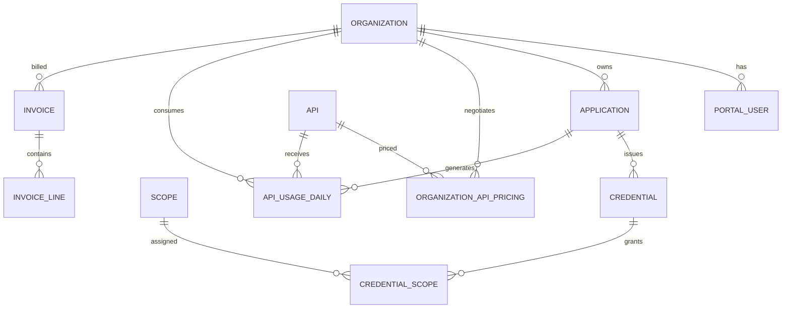

# Domain model



## Organization and Portal User

`Organization` is the tenant boundary. Applications, Credentials, usage, pricing and invoices are always filtered by its ID.

`PortalUser` provides human access to one Organization. Passwords are stored as PBKDF2 hashes and authentication creates an HttpOnly cookie session.

## Application

An Application represents one customer integration. Its type (`Web`, `ERP`, `Job` or `Mobile`) is informational. Disabling an Application blocks all of its active API keys without revoking them; reactivating it allows still-valid keys to work again.

Deleting an Application removes its management records while historical usage and invoice data remain available for reporting.

## Credential and Scope

A Credential belongs to an Application and contains:

- A public `ClientId`, used to locate the record.
- A hashed secret, never returned after creation.
- A display name.
- Optional expiration and revocation dates.
- One or more Scopes through `CredentialScope`.

The API key shown to the customer combines the public identifier and secret:

```text
app_<client-id>.sk_<secret>
```

## Usage and pricing

`ApiUsageDaily` stores daily aggregates by Organization, Application, API and normalized endpoint. It includes request count, error count and average latency.

`OrganizationApiPricing` stores price-per-request records with an `EffectiveFrom` date. Existing records are not overwritten when a rate changes, allowing historical usage to retain the correct price.

## Invoice

An Invoice represents one completed calendar month and has an `Open` or `Paid` status. Its lines are snapshots grouped by:

- API
- Endpoint
- Pricing effective period

Each line stores requests, errors, billable requests, rate and amount. Persisting those values prevents later pricing changes from modifying an issued invoice.

Previous: [Architecture](./01-architecture.md) · Next: [Authentication](./03-auth.md)
